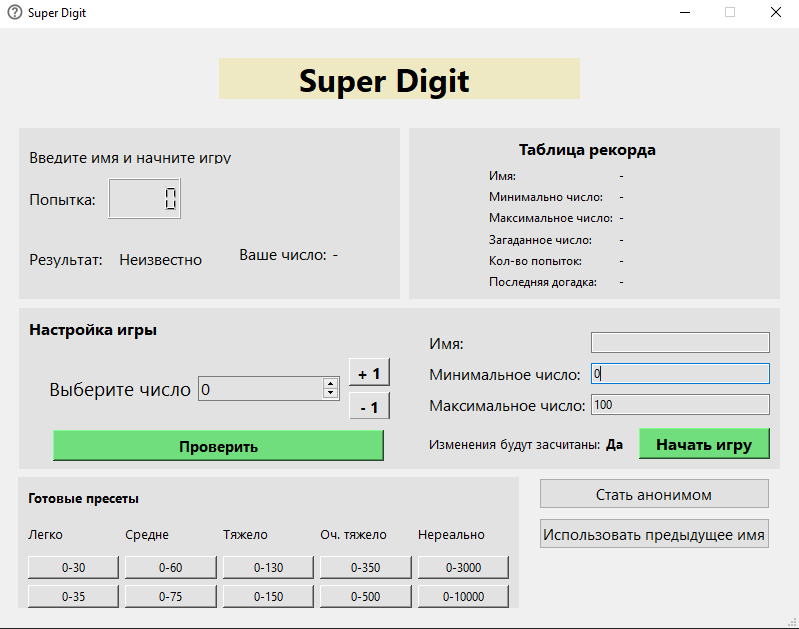
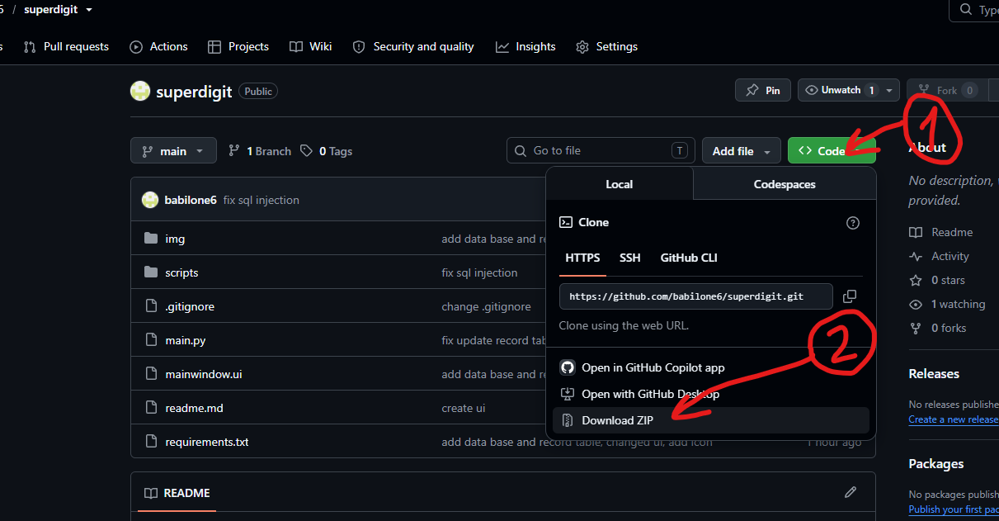
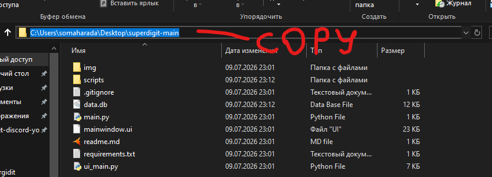
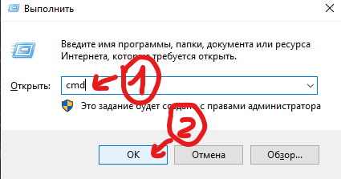
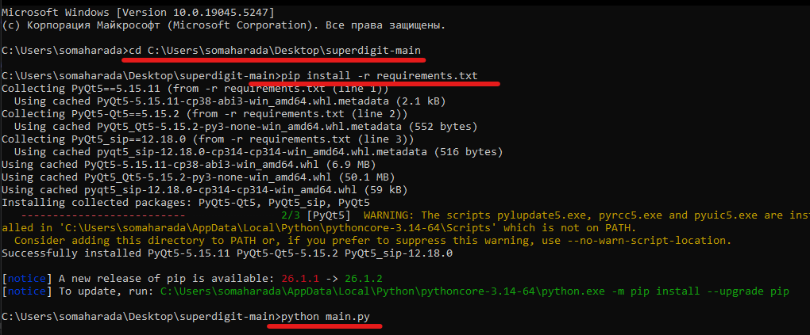

# Super Digit

#### Развлекательно приложение для угадывания заданного числа из выбранного пользователем диапозона чисел.

# Иструкция по запуску
### 1. Скачиваете и распаковывайте репозиторий в любое месте

### 2. Копируем абсолютный путь к папку!

### 3. Открываем командную строку

### 4. Вводим по очереди команды
#### cd {пусть в папку}

#### pip install -r requirements.txt

#### python main.py

# Руководство по использованию
### 1. Введите желаемое имя или нажмите кнопку "Стать анонимом"
### 2. Выберите готовый пресет иди введите свой диапозон угадывания
### 3. Нажмите "Начать игру"
### 4. Выберете любое число и прорьте его, поле результат покажет как близко вы

# Контакты и лицензия
Автор студент ФГБОУ ВО «ЧГУ им. И.Н. Ульянова», для связи используйте почту babilone6@yandex.ru

Код не защищён никакиеми правами, копируйте мне не жалко.